# Amplify-Flix

[한국어](README_ko.md)

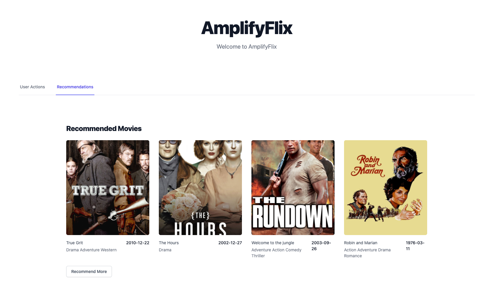

본 워크샾에서는, [Amplify](https://docs.amplify.aws/), [Next.js](https://nextjs.org/), [GraphQL](https://graphql.org/) 을 이용하여 AWS 위에 full-stack serverless application 을 만들어 보려합니다

Netflix, Watcha 와 같은 어플리케이션을 만들어보려 합니다.
추천 영화들을 보여주고, 영화를 선택하면, 상세정보를 볼수 있게 됩니다.
추가적으로 어드민인 경우, 영화 영상을 업로드 할수 있게 되고, 업로드 된 영상은 로그인 된 사용자들이 다운로드 할수 있게 됩니다.

그리고 사용자의 액션은 AWS Kinesis DataStream 으로 보내지게 됩니다. Kinesis DataStream 으로 들어온 데이터는 추후에 Anlaytics 나 AI/ML (예 : 추천) 을 위한 작업에 사용될수 있습니다.

## Overview

Create Next App 을 이용하여 새로운 어플리케이션을 생성합니다.

Amplify CLI 를 이용하여 AWS Cloud 환경을 셋업하고, Amplify Library 를 이용하여 어플리케이션을 백엔드와 연결합니다.

본 가이드는 1~2 시간정도 소요됩니다.

This project will be a fully-serverless application with following architecture.

[Demo](https://dev.d1x2h1aq8od9j1.amplifyapp.com/)

### Required Background / Level

본 워크샾은 AWS Amplify 를 이용하여 full stack serverless 어플리케이션을 개발하고 배포하고 싶은 front-end 와 back-end 개발자들을 위해 만들어졌습니다.

React 에대한 지식이 있다면 도움이 되지만, 필수는 아닙니다.

### Topics we will cover

- Next.js application
- Web application Hosting
- Authentication
- Using Personalize to give personalized recommendation to users
- Data Ingestion into Kinesis DataStream
- Deleting the resources

### Features we will implement

1. Application hosting
2. Authentication : Sign Up, Login, Signout
3. Sending data to Kinesis DataStream
4. Application UI
5. Connecting Personalize endpoint

### Development Environment

시작하기전에, 아래 패키지들을 설치해주세요.

- Node.js v10.x or later
- npm v5.x or later
- git v2.14.1 or later

터미널에서 [Bash shell](<https://en.wikipedia.org/wiki/Bash_(Unix_shell)>) 상에서 Amplify CLI 를 실행해서 infra를 생성하고, Next.js application 을 로컬에서 띄우고 브라우져 상에서 테스트 하려 합니다.

### AWS Account

If you don't have an AWS account and would like to create and activate an AWS account, please refer to the following
[link](https://aws.amazon.com/premiumsupport/knowledge-center/create-and-activate-aws-account/).

### Create a Next.js application

[Create Next App](https://nextjs.org/docs/api-reference/create-next-app) 을 이용하여 새로운 프로젝트를 생성해봅시다.

```sh
$ npx create-next-app amplify-flix
```

생성된 디렉토리로 이동해서, aws-amplify 연관 패키지들을 설치해봅시다.

```sh
$ cd amplify-flix
$ yarn add aws-amplify @aws-amplify/ui-react lodash
```

### Styling with TailwindCSS

본 앱에서는 TailwindCSS 를 이용하여 스타일링을 해보려 합니다.

Tailwind CSS 관련 패키지를 설치합시다. devDependencies 에만 들어가도록 설치합니다.

```sh
$ yarn add --dev tailwindcss@latest postcss@latest autoprefixer@latest @tailwindcss/forms @tailwindcss/aspect-ratio
```

Tailwind 관련 설정 파일들 (`tailwind.config.js` `postcss.config.js`) 생성을 위해 다음 명령어를 실행합니다.

```sh
$ npx tailwindcss init -p
```

`tailwind.config.js` 의 내용을 다음과 같이 변경합니다. (production builds 에서 사용되지 않는 스타일링을 tree-shake 하기 위해서입니다.)

```diff
// tailwind.config.js
module.exports = {
-  purge: [],
+  purge: ['./pages/**/*.{js,ts,jsx,tsx}', './components/**/*.{js,ts,jsx,tsx}'],
  darkMode: false, // or 'media' or 'class'
  theme: {
    extend: {},
  },
  variants: {
    extend: {},
  },
-  plugins: [],
+. plugins: [require('@tailwindcss/forms')],
}
```

Tailwind 의 base, component, utilties 스타일이 사용되도록 next.js 에서 생성된 `./styles/globals.css` 파일을 다음과 같이 변경합니다.

```
/* ./styles/globals.css */
@tailwind base;
@tailwind components;
@tailwind utilities;
```

> TailwindCSS 설치에 대한 자세한 내용은, 다음 링크를 확인하세요. [here](https://tailwindcss.com/docs/guides/nextjs)

### / root page

기본으로 생성된 **pages/index.js** 를 변경합니다.

```js
/* pages/index.js */
import Head from "next/head";

function Home() {
  return (
    <div>
      <Head>
        <title>AmplifyFlix</title>
        <link
          rel="icon"
          href="data:image/svg+xml,<svg xmlns=%22http://www.w3.org/2000/svg%22 viewBox=%220 0 100 100%22><text y=%22.9em%22 font-size=%2290%22>🎥</text></svg>"
        />
      </Head>

      <div className="container mx-auto">
        <main className="bg-white">
          <div className="px-4 py-16 mx-auto max-w-7xl sm:py-24 sm:px-6 lg:px-8">
            <div className="text-center">
              <p className="mt-1 text-4xl font-extrabold text-gray-900 sm:text-5xl sm:tracking-tight lg:text-6xl">
                AmplifyFlix
              </p>
              <p className="max-w-xl mx-auto mt-5 text-xl text-gray-500">
                Welcome to AmplifyFlix
              </p>
            </div>
          </div>
        </main>
      </div>

      <footer></footer>
    </div>
  );
}

export default Home;
```

문제없이 로딩이 되는지, `yarn dev` 명령어로 로컬에서 서버를 띄우고, 브라우져에서 확인해봅니다.

```sh
$ yarn dev
```

### Intializing a git repostory

본 프로젝트를 위한 git repository를 하나 만들어주세요. (https://github.com/new)
repository 생성을 하였으면, 로컬에서 git 을 초기화 하고, 생성된 repository 의 url 을 추가해주세요.

```sh
$ git init
$ git remote add origin git@github.com:username/project-name.git
$ git add .
$ git commit -m 'initial commit'
$ git push origin main
```

## Install Amplify CLI & Initialize Amplify Project

### Install Amplify CLI

Amplify CLI 를 설치해봅시다.

```sh
$ npm install -g @aws-amplify/cli
```

다음은 CLI 에서 AWS credential 을 사용하도록 설정해봅시다.

> 이 과정에 대한 자세한 설명을 보고 싶으면, 비디오를 확인하세요. [here](https://www.youtube.com/watch?v=fWbM5DLh25U)

```sh
$ amplify configure

- Specify the AWS Region: ap-northeast-2
- Specify the username of the new IAM user: amplify-cli-user
> In the AWS Console, click Next: Permissions, Next: Tags, Next: Review, & Create User to create the new IAM user. Then return to the command line & press Enter.
- Enter the access key of the newly created user:
? accessKeyId: (<YOUR_ACCESS_KEY_ID>)
? secretAccessKey: (<YOUR_SECRET_ACCESS_KEY>)
- Profile Name: amplify-cli-user
```

### Initialzing Amplify Project

amplify 프로젝트를 초기화 해봅시다.

```sh
$ amplify init

- Enter a name for the project: amplifyflix
- Enter a name for the environment: dev
- Choose your default editor: Visual Studio Code (or your default editor)
- Please choose the type of app that youre building: javascript
- What javascript framework are you using: react
- Source Directory Path: src
- Distribution Directory Path: .next
- Build Command: npm run-script build
- Start Command: npm run-script start
- Do you want to use an AWS profile? Y
- Please choose the profile you want to use: amplify-cli-user
```

> **Distribution Directory Path 는 꼭 `.next` 으로 변경해주세요.** (build 의 결과물은 .next 로 저장됩니다.)

> `amplify init` 초기화가 끝나면, **amplify** 폴더가 생성되고 **src** 폴더아래 `aws-exports.js` 파일이 생성됩니다.

> **src/aws-exports.js** 는 amplify 의 설정값들이 들어있습니다.

> **amplify/team-provider-info.json** 파일에는 amplify 프로젝트의 back-end 환경(env) 관련 변수들이 들어가 있습니다. 다른 사람들과 동일한 백엔드 환경을 공유하고 싶다면, 이 파일을 공유하면 됩니다. 만약에 프로젝트를 공개하고 싶은 경우라면 이 파일은 빼주는게 좋습니다. (.gitignore 에 추가) [관련문서](https://docs.amplify.aws/cli/teams/shared)

amplify 프로젝트의 상태를 보고 싶다면 `amplify status` 명령어로 확인하실수 있습니다.

```sh
$ amplify status
```

amplify 프로젝트 상태를 Amplify console 로 확인하고 싶다면, `amplify console` 명령어로 확인할수 있습니다.

```sh
$ amplify console
```

### Configuring the Next applicaion with Amplify

Amplify 프로젝트가 생성되고 준비되었으니, app 을 통해 테스트 해봅시다.

우선 해야할일은, 우리가 만들고 있는 app 에서 Amplify project 에 대해 인식하도록 설정하는 것입니다. src 폴더 안에 자동생성된 `aws-exports.js` 파일을 참조하도록 추가해봅시다.

설정을 하기위해 **pages/\_app.js** 파일을 열고, 다음 코드를 추가합니다.

```diff
  import '../styles/globals.css'
+ import Amplify from "aws-amplify";
+ import config from "../src/aws-exports";
+ Amplify.configure(config);

  function MyApp({ Component, pageProps }) {
    return <Component {...pageProps} />
  }

  export default MyApp
```

위 코드가 추가되면, app 에서 Amplify 를 통해 셋업된 AWS service 를 이용할 준비가 됩니다.

## Hosting

Amplify Hosting 에 우리의 어플리케이션을 배포해봅시다.

code repository 를 연결하면 이후는 자동으로 배포가 이루어집니다.

관련해서는 다음 링크를 확인해주세요. [Amplify Hosting](https://deploy-server-side-rendered-app-on-amplify.workshop.aws/ko/amplify-hosting.html)

## TMDB 데이터

영화 데이터와 포스터 이미지 정보는 TMDB api 를 통해 가져옵니다. https://www.themoviedb.org/documentation/api

### TMDB 계정 생성

api 이용을 위해 https://www.themoviedb.org/ 에서 계정을 생성하고 api key 를 받아주세요.

### Sample TMDB ids

**src/sample_movie_ids.json** 파일을 생성하고 다음 파일의 내용을 저장합니다. [sample_movie_ids.json](src/sample_movie_ids.json)

## Recommended Movie 목록 UI

추천 영화 목록의 UI 를 구현해봅시다. 일단은 sample_tmdb_ids 를 섞은후 순서대로 보여줍니다.

### RecommendedMovies UI 컴포넌트 추가

**components/RecommendedMovies.js** 파일에 RecommendedMovies 컴포넌트를 만들어봅시다.

```js
const TMDB_MOVIE_POSTER_PATH = "https://image.tmdb.org/t/p/original/";

function generateMoviePosterUrl(posterPath) {
  return `${TMDB_MOVIE_POSTER_PATH}${posterPath}`;
}

function RecommendedMovies({ recommendedMovies, loadMore }) {
  return (
    <div className="bg-white">
      <div className="max-w-2xl px-4 py-16 mx-auto sm:py-24 sm:px-6 lg:max-w-7xl lg:px-8">
        <h2 className="text-2xl font-extrabold tracking-tight text-gray-900">
          Recommended Movies
        </h2>

        <div className="grid grid-cols-1 mt-6 gap-y-10 gap-x-6 sm:grid-cols-2 lg:grid-cols-4 xl:gap-x-8">
          {recommendedMovies.map((movie) => (
            <div key={movie.id} className="relative group">
              <div className="w-full overflow-hidden bg-gray-200 rounded-md min-h-80 aspect-w-1 aspect-h-1 group-hover:opacity-75 lg:h-80 lg:aspect-none">
                
              </div>
              <div className="flex justify-between mt-4">
                <div>
                  <h3 className="text-sm text-gray-700">
                    <a href="#">
                      <span aria-hidden="true" className="absolute inset-0" />
                      {movie.title}
                    </a>
                  </h3>
                  <p className="mt-1 text-sm text-gray-500">
                    {movie.genres && movie.genres.map((g) => g.name).join(" ")}
                  </p>
                </div>
                <p className="text-sm font-medium text-gray-900">
                  {movie.release_date}
                </p>
              </div>
            </div>
          ))}
        </div>
        <div className="mt-6">
          <button
            onClick={loadMore}
            type="button"
            className="inline-flex items-center px-4 py-2 text-sm font-medium text-gray-700 bg-white border border-gray-300 rounded-md shadow-sm hover:bg-gray-50 focus:outline-none focus:ring-2 focus:ring-offset-2 focus:ring-indigo-500"
          >
            Recommend More
          </button>
        </div>
      </div>
    </div>
  );
}

export default RecommendedMovies;
```

### useRecommendedMovies custom hook 추가

**hooks/useRecommendedMovies.js** 파일에 recommendedMovies 데이터를 로딩하고 저장하는 custom hook 을 만들어줍니다.

```js
import { useEffect, useState } from "react";
import _ from "lodash";
import SAMPLE_MOVIE_IDS from "../src/sample_movie_ids.json";
const SAMPLE_TMDB_IDS = SAMPLE_MOVIE_IDS.map((e) => e.tmdbId);

const TMDB_API_KEY = "your-tmdb-api-key";
const TMDB_MOVIE_API_URL = "https://api.themoviedb.org/3/movie/";

function generateTmdbMovieApiUrl(tmdbId) {
  return `${TMDB_MOVIE_API_URL}${tmdbId}?api_key=${TMDB_API_KEY}`;
}

async function fetchMovieDatas(tmdbIds) {
  const urls = tmdbIds.map((tmdbId) => generateTmdbMovieApiUrl(tmdbId));
  console.log(urls);
  const responses = await Promise.all(urls.map((url) => fetch(url)));
  const datas = await Promise.all(responses.map((response) => response.json()));
  return datas;
}

function useRecommnededMovies() {
  const [recommendedTmdbIds, setRecommendedTmdbIds] = useState(
    _.shuffle(SAMPLE_TMDB_IDS)
  );
  const [recommendedMovies, setRecommendedMovies] = useState([]);
  const [currIdx, setCurrIdx] = useState(0);
  const SAMPLING_SIZE = 4;

  useEffect(() => {
    loadMore();
  }, [recommendedTmdbIds]);

  async function fetchData(startingIdx) {
    const ids = recommendedTmdbIds.slice(
      startingIdx,
      startingIdx + SAMPLING_SIZE
    );
    setCurrIdx(startingIdx + SAMPLING_SIZE);

    fetchMovieDatas(ids).then((datas) => {
      console.log(datas);
      setRecommendedMovies([...recommendedMovies, ...datas]);
    });
  }

  function loadMore() {
    if (currIdx >= recommendedTmdbIds.length) {
      console.log("reached end!");
      return;
    }
    fetchData(currIdx);
    setCurrIdx(currIdx + SAMPLING_SIZE);
  }

  return { recommendedMovies, loadMore };
}

export default useRecommnededMovies;
```

방금 만든 RecommendedMovies 컴포넌트를 **pages/index.js** 에서 렌더되도록 합니다.

```diff
import Head from "next/head";
+ import RecommendedMovies from "../components/RecommendedMovies";
+ import useRecommnededMovies from "../hooks/useRecommendedMovies";

function Home() {
+ const { recommendedMovies, loadMore } = useRecommnededMovies();

  return (
    <div>
      <Head>
        <title>AmplifyFlix</title>
        <link
          rel="icon"
          href="data:image/svg+xml,<svg xmlns=%22http://www.w3.org/2000/svg%22 viewBox=%220 0 100 100%22><text y=%22.9em%22 font-size=%2290%22>🐕</text></svg>"
        />
      </Head>

      <div className="container mx-auto">
        <main className="bg-white">
          <div className="px-4 py-16 mx-auto max-w-7xl sm:py-24 sm:px-6 lg:px-8">
            <div className="text-center">
              <p className="mt-1 text-4xl font-extrabold text-gray-900 sm:text-5xl sm:tracking-tight lg:text-6xl">
                AmplifyFlix
              </p>
              <p className="max-w-xl mx-auto mt-5 text-xl text-gray-500">
                Welcome to AmplifyFlix
              </p>
            </div>
          </div>
          <Tabs
            tabs={DEFAULT_TABS}
            selectedTabName={selectedTabName}
            setSelectedTabName={setSelectedTabName}
          ></Tabs>

+         <RecommendedMovies recommendedMovies={recommendedMovies} loadMore={loadMore} />
        </main>
      </div>

      <footer></footer>
    </div>
  );
}
```

## User Actions 목록 UI

사용자 액션 목록을 보여줄 UI 를 만들어봅시다.

### Tabs 추가

일단 User Actions 와 Recommnended Movies UI 를 토글 할수 있게 Tab 을 추가해봅시다.

**components/Tabs.js** 파일에 Tabs 컴포넌트를 만들어봅시다.

```js
function classNames(...classes) {
  return classes.filter(Boolean).join(" ");
}

function Tabs({ tabs, selectedTabName, setSelectedTabName }) {
  return (
    <div>
      <div className="sm:hidden">
        <label htmlFor="tabs" className="sr-only">
          Select a tab
        </label>
        <select
          id="tabs"
          name="tabs"
          className="block w-full py-2 pl-3 pr-10 text-base border-gray-300 rounded-md focus:outline-none focus:ring-indigo-500 focus:border-indigo-500 sm:text-sm"
          defaultValue={tabs.find((tab) => tab.current).name}
        >
          {tabs.map((tab) => (
            <option key={tab.name}>{tab.name}</option>
          ))}
        </select>
      </div>
      <div className="hidden sm:block">
        <div className="border-b border-gray-200">
          <nav className="flex -mb-px space-x-8" aria-label="Tabs">
            {tabs.map((tab) => (
              <a
                key={tab.name}
                href={tab.href}
                onClick={() => setSelectedTabName(tab.name)}
                className={classNames(
                  tab.name === selectedTabName
                    ? "border-indigo-500 text-indigo-600"
                    : "border-transparent text-gray-500 hover:text-gray-700 hover:border-gray-300",
                  "whitespace-nowrap py-4 px-1 border-b-2 font-medium text-sm"
                )}
                aria-current={tab.current ? "page" : undefined}
              >
                {tab.name}
              </a>
            ))}
          </nav>
        </div>
      </div>
    </div>
  );
}

export default Tabs;
```

### UserActions UI 컴포넌트 추가

**components/UserActions.js** 에 UserActions 컴포넌트를 만들어봅시다.

```js
function UserActions({ userActions = [] }) {
  return (
    <div className="bg-white">
      <div className="max-w-2xl px-4 py-16 mx-auto sm:py-24 sm:px-6 lg:max-w-7xl lg:px-8">
        <h2 className="text-2xl font-extrabold tracking-tight text-gray-900">
          User Actions
        </h2>

        <div className="grid grid-cols-1 mt-6 gap-y-10 gap-x-6 sm:grid-cols-1 lg:grid-cols-1 xl:gap-x-8">
          <ul role="list" className="divide-y divide-gray-200">
            {userActions.map((activityItem) => (
              <li key={activityItem.id} className="py-4">
                <div className="flex space-x-3">
                  
                  <div className="flex-1 space-y-1">
                    <div className="flex items-center justify-between">
                      <h3 className="text-sm font-medium">
                        {activityItem.person.name}
                      </h3>
                      <p className="text-sm text-gray-500">
                        {activityItem.time}
                      </p>
                    </div>
                    <p className="text-sm text-gray-500">
                      Deployed {activityItem.project} ({activityItem.commit} in
                      master) to {activityItem.environment}
                    </p>
                  </div>
                </div>
              </li>
            ))}
          </ul>
        </div>
      </div>
    </div>
  );
}

export default UserActions;
```

방금 만든 UserActions 컴포넌트를 **pages/index.js** 에서 렌더되도록 합니다.

```diff
import Head from "next/head";
import RecommendedMovies from "../components/RecommendedMovies";
import useRecommnededMovies from "../hooks/useRecommendedMovies";
+ import Tabs from "../components/Tabs";
+ import UserActions from "../components/UserActions";

+ const DEFAULT_TABS_DATA = [
+   { name: "User Actions", href: "#", current: false },
+   { name: "Recommendations", href: "#", current: true },
+ ];
+
+ const people = [
+   {
+     name: "Lindsay Walton",
+     imageUrl:
+       "https://images.unsplash.com/photo-1517841905240-472988babdf9?ixlib=rb-1.2.1&ixid=eyJhcHBfaWQiOjEyMDd9&auto=format&fit=facearea&facepad=3&w=256&h=256&q=80",
+   },
+ ];
+ const DEFAULT_USER_ACTIONS = [
+   {
+     id: 1,
+     person: people[0],
+     project: "Workcation",
+     commit: "2d89f0c8",
+     environment: "production",
+     time: "1h",
+   },
+ ];

function Home() {
  const { recommendedMovies, loadMore } = useRecommnededMovies();
+ const [selectedTabName, setSelectedTabName] = useState("Recommendations");

  return (
    <div>
      <Head>
        <title>AmplifyFlix</title>
        <link
          rel="icon"
          href="data:image/svg+xml,<svg xmlns=%22http://www.w3.org/2000/svg%22 viewBox=%220 0 100 100%22><text y=%22.9em%22 font-size=%2290%22>🐕</text></svg>"
        />
      </Head>

      <div className="container mx-auto">
        <main className="bg-white">
          <div className="px-4 py-16 mx-auto max-w-7xl sm:py-24 sm:px-6 lg:px-8">
            <div className="text-center">
              <p className="mt-1 text-4xl font-extrabold text-gray-900 sm:text-5xl sm:tracking-tight lg:text-6xl">
                AmplifyFlix
              </p>
              <p className="max-w-xl mx-auto mt-5 text-xl text-gray-500">
                Welcome to AmplifyFlix
              </p>
            </div>
          </div>
          <Tabs
            tabs={DEFAULT_TABS}
            selectedTabName={selectedTabName}
            setSelectedTabName={setSelectedTabName}
          ></Tabs>

-         <RecommendedMovies recommendedMovies={recommendedMovies} loadMore={loadMore} />
+         <Tabs
+           tabs={DEFAULT_TABS_DATA}
+           selectedTabName={selectedTabName}
+           setSelectedTabName={setSelectedTabName}
+         />
+         {selectedTabName === "Recommendations" && (
+           <RecommendedMovies
+             recommendedMovies={recommendedMovies}
+             loadMore={loadMore}
+           />
+         )}
+         {selectedTabName === "User Actions" && (
+           <UserActions userActions={DEFAULT_USER_ACTIONS} />
+         )}
        </main>
      </div>

      <footer></footer>
    </div>
  );
}

```

## Personalize 연동

Amazon Personalize 가이드를 따라 추천엔진을 생성해봅니다.

[Amazon Personalize Demo](https://www.youtube.com/watch?v=D92kcZkcWzs)

### Personalize Campaign ARN 확인

정상적으로 진행이 되었다면 다음과 같이 캠페인이 생성이 되어있고, Campaign ARN 을 확인할수 있습니다.

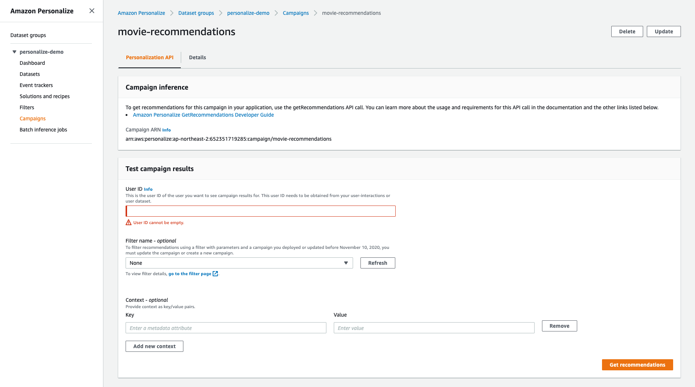

### Personalize 호출을 위한 Cognito Identity Pool 생성

우리의 어플리케이션에서 Personalize Campaign 을 호출하기 위해선 인증이 필요합니다. 인증을 위해 Cognito Identity Pool 이 필요합니다.

Cognito Identity Pool 을 생성해봅시다.

Cognito 페이지로 이동합시다. (https://ap-northeast-2.console.aws.amazon.com/cognito/home?region=ap-northeast-2)
페이지 이동후 `Manage Identity Pools` 를 클릭합니다.

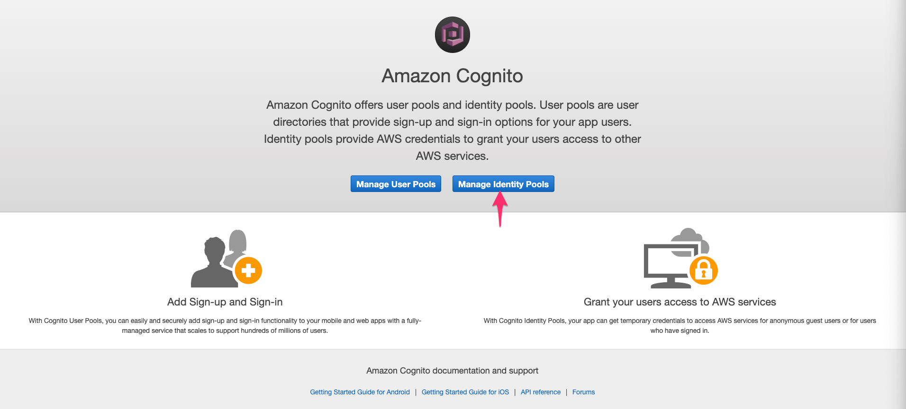

`Create new identity pool` 버튼을 클릭하면 새로운 identity pool 을 생성하기 위한 페이지로 이동합니다.

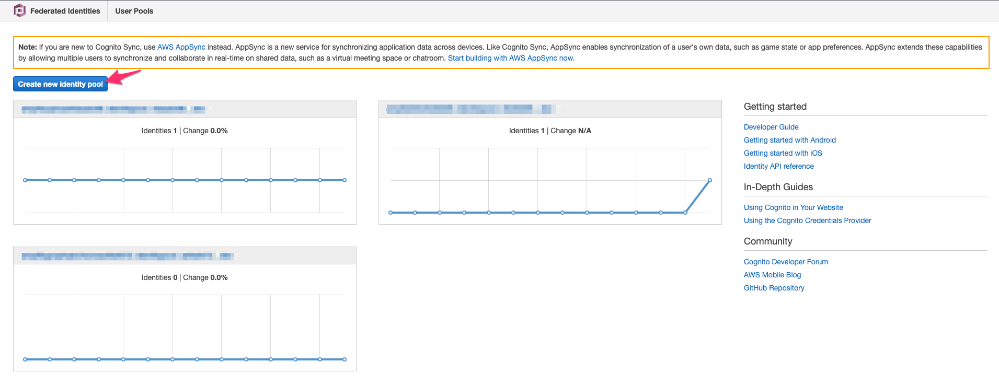

새로운 identity pool 을 다음과 같이 생성합니다.

- Identity pool name 은 우리의 어플리케이션 이름을 넣어줍니다 (예 : amplifyflix)
- `Enable access to unauhorized identity` 는 체크를 해줍니다. (이유 : 로그인 되지 않은 사용자의 경우에도 추천 목록을 보여줘야 하기 때문에)

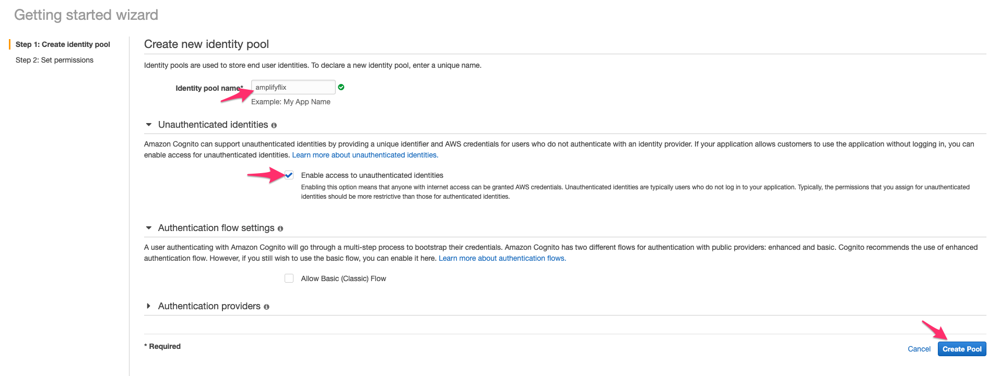

다음은, Identity pool 에서 사용될 IAM role 을 지정합니다. show detail 을 눌러 펼친후, 기본 설정된 값으로 하시면 됩니다.


과정이 완료되면 AWS SDK 셋업시 Cognito Identity 를 통해 인증하는 샘플 코드를 다음과 같이 확인하실수 있습니다.

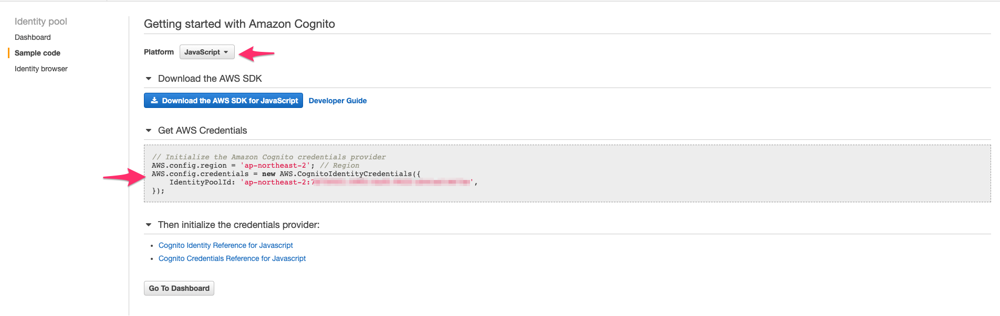

`Attach policies` 를 클릭합니다.

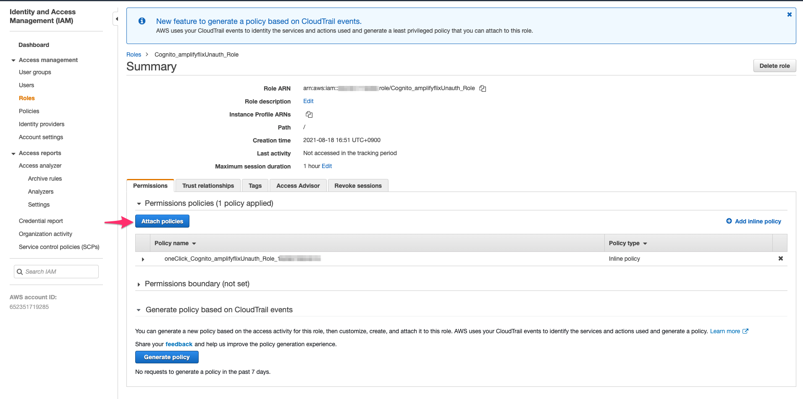

filter 에서 `personalize` 로 검색해서 나오는 `AmazonPersonalizeFullAccess` 를 선택후 `Attach Policy` 를 클릭합니다.

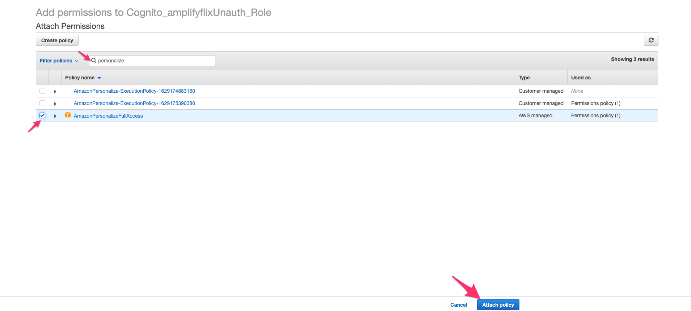

### Identity Pool 에 붙은 IAM Role 에 Permission 추가

Identity pool 에 붙은 IAM Role 에서는 Personalize campaign 호출을 하기 위한 permission 이 필요합니다.

https://console.aws.amazon.com/iamv2/home#/roles 페이지로 이동하여 해당 IAM Role 에 permission 을 다음과정으로 추가해봅시다.

- `Cognito` 로 검색하면 이전 과정에서 생성된 role 이 나옵니다. (예 : `Cognito_amplifyflixUnauth_Role`) 해당 role 을 선택합니다.

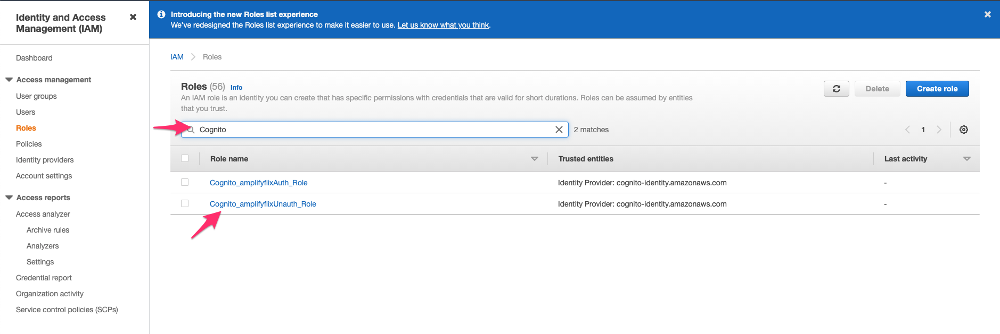

### AWS SDK 를 통한 연동

자 이제 인증을 위한 identity pool 이 준비가 되었으니, AWS SDK 를 통해 우리의 어플리케이션에서 Personalize Campaign 을 호출하도록 해봅시다.

우선 aws-sdk 를 설치합니다.

```sh
$ yarn add aws-sdk
```

다음은, aws-sdk 를 설정해봅시다. 최상위 컴포넌트인 **pages/\_app.js** 파일에 aws-sdk 설정을 하도록 하겠습니다.

```diff
import config from "../src/aws-exports";
Amplify.configure(config);

+ import AWS from "aws-sdk";
+ AWS.config.region = "ap-northeast-2"; // Region
+ AWS.config.credentials = new AWS.CognitoIdentityCredentials({
+   IdentityPoolId: "ap-northeast-2:7d750501-0993-4a45-9422-a541e214672e",
+ });

```

### getRecommendations

aws-sdk 가 준비되었으니, 이제 getRecommendations 로 추천을 받도록 코드를 변경해봅시다.
**hooks/useRecommendedMovies.js** 파일을 다음과 같이 바꿔봅시다.

```js
import { useEffect, useState } from "react";
import _ from "lodash";
import AWS from "aws-sdk";
import SAMPLE_MOVIE_IDS from "../src/sample_movie_ids.json";

const MOVIE_ID_TO_TMDB_ID = {};
SAMPLE_MOVIE_IDS.forEach(
  (e) => (MOVIE_ID_TO_TMDB_ID[`${e.movieId}`] = e.tmdbId)
);

const TMDB_API_KEY = "your-tmdb-api-key"; // 생성된 tmdb api key
const TMDB_MOVIE_API_URL = "https://api.themoviedb.org/3/movie/";

function generateTmdbMovieApiUrl(tmdbId) {
  return `${TMDB_MOVIE_API_URL}${tmdbId}?api_key=${TMDB_API_KEY}`;
}

async function fetchMovieDatas(tmdbIds) {
  const urls = tmdbIds.map((tmdbId) => generateTmdbMovieApiUrl(tmdbId));
  console.log(urls);
  const responses = await Promise.all(urls.map((url) => fetch(url)));
  const datas = await Promise.all(responses.map((response) => response.json()));
  return datas;
}

async function getRecommendations({ userId, numResults = 48 }) {
  // 생성된 personalize campaign arn
  const personalizeParams = {
    campaignArn:
      "arn:aws:personalize:ap-northeast-2:your-personalize-campaign-arn:campaign/movie-recommendations",
    numResults,
    userId,
  };

  const personalizeRuntime = new AWS.PersonalizeRuntime();

  const data = await personalizeRuntime
    .getRecommendations(personalizeParams)
    .promise();
  const itemList = data.itemList;
  return itemList;
}

function useRecommnededMovies() {
  const [recommendedTmdbIds, setRecommendedTmdbIds] = useState([]);
  const [recommendedMovies, setRecommendedMovies] = useState([]);
  const [currIdx, setCurrIdx] = useState(0);
  const SAMPLING_SIZE = 4;

  useEffect(() => {
    const userId = "random-user-id"; // userId 를 가져올수 있는 상황이면 (예 : 로그인 상태) userId 값을 전달.
    getRecommendations({ userId }).then((recommendations) => {
      console.log(recommendations);
      const movieIds = recommendations.map((e) => e.itemId);
      const tmdbIds = movieIds
        .map((movieId) => MOVIE_ID_TO_TMDB_ID[movieId])
        .filter((e) => e !== undefined); // NOTE : some data missing
      setRecommendedTmdbIds(tmdbIds);
    });
  }, []);

  useEffect(() => {
    loadMore();
  }, [recommendedTmdbIds]);

  async function fetchData(startingIdx) {
    const ids = recommendedTmdbIds.slice(
      startingIdx,
      startingIdx + SAMPLING_SIZE
    );
    setCurrIdx(startingIdx + SAMPLING_SIZE);

    fetchMovieDatas(ids).then((datas) => {
      console.log(datas);
      setRecommendedMovies([...recommendedMovies, ...datas]);
    });
  }

  function loadMore() {
    if (currIdx >= recommendedTmdbIds.length) {
      console.log("reached end!");
      return;
    }
    fetchData(currIdx);
    setCurrIdx(currIdx + SAMPLING_SIZE);
  }

  return { recommendedMovies, loadMore };
}

export default useRecommnededMovies;
```

## Authentication

다음과정은, authentication을 추가를 해보겠습니다.

authentication 추가를 위해, `ampfliy add auth` 명령어를 실행합니다.

```sh
$ amplify add auth

? Do you want to use default authentication and security configuration? Default configuration
? How do you want users to be able to sign in when using your Cognito User Pool? Username
? Do you want to configure advanced settings? No, I am done.
```

변경사항 적용을 위해 `amplify push` 명령어를 실행합니다.

```sh
$ amplify push
? Are you sure you want to continue? Yes
```

### withAuthenticator

인증/로그인된 사용자들만 접근할수 있는 페이지에 `withAuthenticator` HOC (Higher Order Component) 를 적용하면 됩니다.

예를들어, 특정 페이지에 withAuthenticator 를 적용하면, 사용자는 반드시 로그인을 해야만 페이지에 접근이 가능합니다. 만약에 로그인이 되어있지 않다면, 로그인 페이지로 이동하게 됩니다.

테스트를 위해 **/pages/index.js** 를 변경해봅시다.

```diff
/* pages/index.js */
import Head from "next/head";
+ import { withAuthenticator } from "@aws-amplify/ui-react";

- export default Home;
+ export default withAuthenticator(Home);
```

> Authenticator UI Component 관련 문서 [here](https://docs.amplify.aws/ui/auth/authenticator/q/framework/react)

코드를 변경했으면 브라우져에서 테스트 해봅시다.

```sh
yarn dev
```

로그인 프롬프트가 뜨는 것으로, Authentication 플로우가 app 에 추가된것을 확인할 수 있습니다.

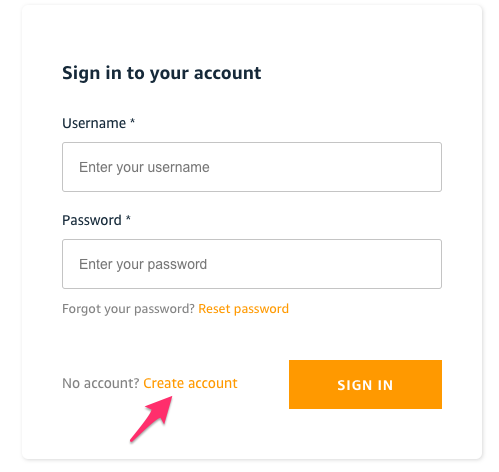

테스트를 위해 계정생성을 해봅시다.

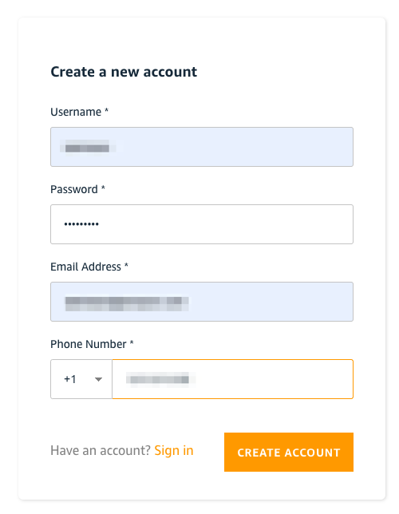

계정 생성을 하면 입력한 이메일로 confirmation code 가 전송됩니다.
이메일로 받은 confirmation code 를 입력해서 계정 생성을 마무리 합니다.

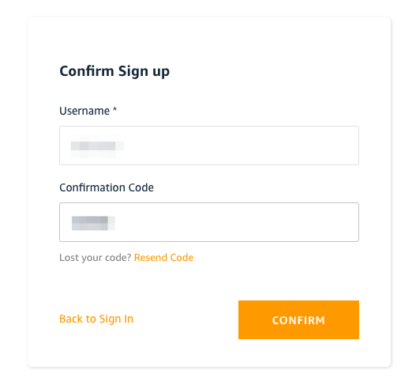

auth console 로 들어가면 생성된 사용자를 확인할수 있습니다.

```sh
$ amplify console auth

> Choose User Pool
```

### Signout

Signout 기능을 Signout UI Compnonent 를 이용해 추가해봅시다.

`AmplifySignout` compoent 를 페이지 어딘가에 넣어주세요.

```js
import { withAuthenticator, AmplifySignOut } from "@aws-amplify/ui-react";

/* UI 어딘가에 넣어주세요. */
<AmplifySignOut />;
```

> Sign Out UI Component 문서 [here](https://docs.amplify.aws/ui/auth/sign-out/q/framework/react)

SignOut 버튼을 눌러서 로그아웃이 잘 되는지도 확인해보세요.

### Accessing User Data

로그인 상태에서 `Auth.currentAuthenticatedUser()` 로 사용자 정보를 가져올수 있습니다.

사용자 정보 확인을 위해 **pages/index.js** 파일을 변경해봅시다.

```diff
+ import { useEffect } from "react";
+ import { Auth } from "aws-amplify";

+ function useUser() {
+   const [user, setUser] = useState(null);
+
+   useEffect(() => {
+     checkUser();
+   }, []);
+
+   async function checkUser() {
+     const u = await Auth.currentAuthenticatedUser();
+     setUser(u);
+   }
+
+   return { user, setUser };
+ }

function Home() {
  const [selectedTabName, setSelectedTabName] = useState("Recommendations");
  const { recommendedMovies, loadMore } = useRecommnededMovies();
+ const { user } = useUser();

  /* 이전과 동일 */
}
```

브라우져 콘솔을 열고 / 페이지를 로딩하면, 콘솔에 로그인된 사용자 정보들과 attributes 들이 출력되는걸 확인할수 있습니다.

## Additional TODO's

- 로그인 된 사용자만 추천을 받을수 있게 바꿔보세요.
  | 힌트 : https://docs.aws.amazon.com/cognito/latest/developerguide/amazon-cognito-integrating-user-pools-with-identity-pools.html

## 리소스 삭제

Amplify CLI 로 추가된 리소스를 삭제하고 싶으시면 `amplify remove`

예를들어 `amplify remove auth` 는 authentication 기능을 프로젝트에서 삭제합니다.

```sh
$ amplify remove auth
```

적용을 위해서는 `amplify push` 명령어를 실행합니다.

```
$ amplify push
```

If you are not sure about which services you have enabled, you can check with `amplify status`

```sh
$ amplify status
```

### 프로젝트 삭제

본 가이드에서 생성된 Amplify 프로젝트를 지우고 싶으시면 `amplify delete` 를 실행하세요

```sh
$ amplify delete
```
