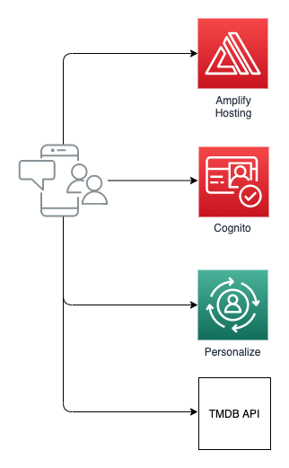

# Amplify-Flix

[한국어](README_ko.md)


본 워크샾에서는, [Amplify](https://docs.amplify.aws/), [Next.js](https://nextjs.org/), [GraphQL](https://graphql.org/) 을 이용하여 AWS 위에 full-stack serverless application 을 만들어 보려합니다

Netflix, Watcha 와 같은 어플리케이션을 만들어보려 합니다.
추천 영화들을 보여주고, 영화를 선택하면, 상세정보를 볼수 있게 됩니다.

<br />

## Overview

Create Next App 을 이용하여 새로운 어플리케이션을 생성합니다.

Amplify CLI 를 이용하여 AWS Cloud 환경을 셋업하고, Amplify Library 를 이용하여 어플리케이션을 백엔드와 연결합니다.

본 가이드는 2~3 시간정도 소요됩니다.

[Demo](https://dev.d1x2h1aq8od9j1.amplifyapp.com/)

<br />

### Architecture

본 가이드로 만들어지는 어플리케이션은 다음 그림과 같은 full-serverless architecture 입니다.



### Required Background / Level

본 워크샾은 AWS Amplify 를 이용하여 full stack serverless 어플리케이션을 개발하고 배포하고 싶은 front-end 와 back-end 개발자들을 위해 만들어졌습니다.

React 에대한 지식이 있다면 도움이 되지만, 필수는 아닙니다.

### Topics we will cover

- Next.js application
- Web application Hosting
- Using Personalize to give personalized recommendation to users
- Deleting the resources

### Features we will implement

1. Application hosting
2. Application UI
3. Connecting Personalize endpoint

<br />

## Development Environment

시작하기전에, 아래 패키지들을 설치해주세요.

- Node.js v10.x or later
- npm v5.x or later
- git v2.14.1 or later

터미널에서 [Bash shell](<https://en.wikipedia.org/wiki/Bash_(Unix_shell)>) 상에서 Amplify CLI 를 실행해서 infra를 생성하고, Next.js application 을 로컬에서 띄우고 브라우져 상에서 테스트 하려 합니다.

<br />

## AWS Account

If you don't have an AWS account and would like to create and activate an AWS account, please refer to the following
[link](https://aws.amazon.com/premiumsupport/knowledge-center/create-and-activate-aws-account/).

<br />

## Create a Next.js application

[Create Next App](https://nextjs.org/docs/api-reference/create-next-app) 을 이용하여 새로운 프로젝트를 생성해봅시다.

```sh
$ npx create-next-app amplify-flix
```

생성된 디렉토리로 이동해서, aws-amplify 연관 패키지들을 설치해봅시다.

```sh
$ cd amplify-flix
$ yarn add aws-amplify @aws-amplify/ui-react lodash
```

### Styling with TailwindCSS

본 앱에서는 TailwindCSS 를 이용하여 스타일링을 해보려 합니다.

Tailwind CSS 관련 패키지를 설치합시다. devDependencies 에만 들어가도록 설치합니다.

```sh
$ yarn add --dev tailwindcss@latest postcss@latest autoprefixer@latest @tailwindcss/forms @tailwindcss/aspect-ratio
```

Tailwind 관련 설정 파일들 (`tailwind.config.js` `postcss.config.js`) 생성을 위해 다음 명령어를 실행합니다.

```sh
$ npx tailwindcss init -p
```

`tailwind.config.js` 의 내용을 다음과 같이 변경합니다. (production builds 에서 사용되지 않는 스타일링을 tree-shake 하기 위해서입니다.)

```diff
// tailwind.config.js
module.exports = {
-  purge: [],
+  purge: ['./pages/**/*.{js,ts,jsx,tsx}', './components/**/*.{js,ts,jsx,tsx}'],
  darkMode: false, // or 'media' or 'class'
  theme: {
    extend: {},
  },
  variants: {
    extend: {},
  },
-  plugins: [],
+. plugins: [require('@tailwindcss/forms')],
}
```

Tailwind 의 base, component, utilties 스타일이 사용되도록 next.js 에서 생성된 `./styles/globals.css` 파일을 다음과 같이 변경합니다.

```
/* ./styles/globals.css */
@tailwind base;
@tailwind components;
@tailwind utilities;
```

> TailwindCSS 설치에 대한 자세한 내용은, 다음 링크를 확인하세요. [here](https://tailwindcss.com/docs/guides/nextjs)

### / root page

기본으로 생성된 **pages/index.js** 를 변경합니다.

```js
/* pages/index.js */
import Head from "next/head";

function Home() {
  return (
    <div>
      <Head>
        <title>AmplifyFlix</title>
        <link
          rel="icon"
          href="data:image/svg+xml,<svg xmlns=%22http://www.w3.org/2000/svg%22 viewBox=%220 0 100 100%22><text y=%22.9em%22 font-size=%2290%22>🎥</text></svg>"
        />
      </Head>

      <div className="container mx-auto">
        <main className="bg-white">
          <div className="px-4 py-16 mx-auto max-w-7xl sm:py-24 sm:px-6 lg:px-8">
            <div className="text-center">
              <p className="mt-1 text-4xl font-extrabold text-gray-900 sm:text-5xl sm:tracking-tight lg:text-6xl">
                AmplifyFlix
              </p>
              <p className="max-w-xl mx-auto mt-5 text-xl text-gray-500">
                Welcome to AmplifyFlix
              </p>
            </div>
          </div>
        </main>
      </div>

      <footer></footer>
    </div>
  );
}

export default Home;
```

문제없이 로딩이 되는지, `yarn dev` 명령어로 로컬에서 서버를 띄우고, 브라우져에서 확인해봅니다.

```sh
$ yarn dev
```

<br />

## Intializing a git repostory

본 프로젝트를 위한 git repository를 하나 만들어주세요. (https://github.com/new)
repository 생성을 하였으면, 로컬에서 git 을 초기화 하고, 생성된 repository 의 url 을 추가해주세요.

```sh
$ git init
$ git remote add origin git@github.com:username/project-name.git
$ git add .
$ git commit -m 'initial commit'
$ git push origin main
```

<br />

## Install Amplify CLI & Initialize Amplify Project

### Install Amplify CLI

Amplify CLI 를 설치해봅시다.

```sh
$ npm install -g @aws-amplify/cli
```

다음은 CLI 에서 AWS credential 을 사용하도록 설정해봅시다.

> 이 과정에 대한 자세한 설명을 보고 싶으면, 비디오를 확인하세요. [here](https://www.youtube.com/watch?v=fWbM5DLh25U)

```sh
$ amplify configure

- Specify the AWS Region: ap-northeast-2
- Specify the username of the new IAM user: amplify-cli-user
> In the AWS Console, click Next: Permissions, Next: Tags, Next: Review, & Create User to create the new IAM user. Then return to the command line & press Enter.
- Enter the access key of the newly created user:
? accessKeyId: (<YOUR_ACCESS_KEY_ID>)
? secretAccessKey: (<YOUR_SECRET_ACCESS_KEY>)
- Profile Name: amplify-cli-user
```

### Initialzing Amplify Project

amplify 프로젝트를 초기화 해봅시다.

```sh
$ amplify init

- Enter a name for the project: amplifyflix
- Enter a name for the environment: dev
- Choose your default editor: Visual Studio Code (or your default editor)
- Please choose the type of app that youre building: javascript
- What javascript framework are you using: react
- Source Directory Path: src
- Distribution Directory Path: .next
- Build Command: npm run-script build
- Start Command: npm run-script start
- Do you want to use an AWS profile? Y
- Please choose the profile you want to use: amplify-cli-user
```

> **Distribution Directory Path 는 꼭 `.next` 으로 변경해주세요.** (build 의 결과물은 .next 로 저장됩니다.)

> `amplify init` 초기화가 끝나면, **amplify** 폴더가 생성되고 **src** 폴더아래 `aws-exports.js` 파일이 생성됩니다.

> **src/aws-exports.js** 는 amplify 의 설정값들이 들어있습니다.

> **amplify/team-provider-info.json** 파일에는 amplify 프로젝트의 back-end 환경(env) 관련 변수들이 들어가 있습니다. 다른 사람들과 동일한 백엔드 환경을 공유하고 싶다면, 이 파일을 공유하면 됩니다. 만약에 프로젝트를 공개하고 싶은 경우라면 이 파일은 빼주는게 좋습니다. (.gitignore 에 추가) [관련문서](https://docs.amplify.aws/cli/teams/shared)

amplify 프로젝트의 상태를 보고 싶다면 `amplify status` 명령어로 확인하실수 있습니다.

```sh
$ amplify status
```

amplify 프로젝트 상태를 Amplify console 로 확인하고 싶다면, `amplify console` 명령어로 확인할수 있습니다.

```sh
$ amplify console
```

### Configuring the Next applicaion with Amplify

Amplify 프로젝트가 생성되고 준비되었으니, app 을 통해 테스트 해봅시다.

우선 해야할일은, 우리가 만들고 있는 app 에서 Amplify project 에 대해 인식하도록 설정하는 것입니다. src 폴더 안에 자동생성된 `aws-exports.js` 파일을 참조하도록 추가해봅시다.

설정을 하기위해 **pages/\_app.js** 파일을 열고, 다음 코드를 추가합니다.

```diff
  import '../styles/globals.css'
+ import Amplify from "aws-amplify";
+ import config from "../src/aws-exports";
+ Amplify.configure(config);

  function MyApp({ Component, pageProps }) {
    return <Component {...pageProps} />
  }

  export default MyApp
```

위 코드가 추가되면, app 에서 Amplify 를 통해 셋업된 AWS service 를 이용할 준비가 됩니다.

<br />

## Amplify Hosting 에 어플리케이션 배포

Amplify Hosting 에 우리의 어플리케이션을 배포해봅시다.

code repository 를 연결하면 이후는 자동으로 배포가 이루어집니다.

관련해서는 다음 링크를 확인해주세요. [Amplify Hosting](https://deploy-server-side-rendered-app-on-amplify.workshop.aws/ko/amplify-hosting.html)

<br />

## 영화 데이터

본 어플리케이션의 화면에 보여질 영화 정보와 포스터 이미지는 TMDB api 를 통해 가져오게 됩니다. https://www.themoviedb.org/documentation/api

따라서 TMDB 계정 생성이 필요합니다.

**api 이용을 위해 https://www.themoviedb.org/ 에서 계정을 생성하고 api key 를 저장해 주세요.**

### movieId, imdbId, tmdbId

TMDB api 를 호출하기 위해선 tmdbId 를 파라미터로 전달해야 합니다.

MovieLens 데이터를 인풋으로 학습된 모델은 movieId 를 키로 해서 학습이 되었고, 추천 데이터를 요청하면 movieId 가 포함된 값이 넘어오게 되어있습니다.

따라서 movieId => tmdbId 로 변환하기 위한 dictionary 가 필요합니다.

일단 **src/sample_movie_ids.json** 파일을 생성하고 다음 파일의 내용을 저장합니다. [sample_movie_ids.json](src/sample_movie_ids.json)

참고로 sample_movie_ids.json 에는 다음과 같은 형식의 데이터가 들어있습니다.

```json
[
  { "movieId": "193587", "imdbId": "8391976", "tmdbId": "483455" },
  { "movieId": "193609", "imdbId": "0101726", "tmdbId": "37891" }
]
```

다음은 어플리케이션 코드에서 사용하기 위한 movie_id => tmdb_id dictionary 를 **src/movie_id_to_tmdb_id.js** 파일에 생성합니다.

```js
/* src/movie_id_to_tmdb_id.js */
import SAMPLE_MOVIE_IDS from "../src/sample_movie_ids.json";

const MOVIE_ID_TO_TMDB_ID = {};
SAMPLE_MOVIE_IDS.forEach(
  (e) => (MOVIE_ID_TO_TMDB_ID[`${e.movieId}`] = e.tmdbId)
);

export default MOVIE_ID_TO_TMDB_ID;
```

<br />

## 사용자 액티비티 데이터

추천 결과 확인을 검증하기 위해, 모델 학습에 사용되었던 사용자 액티비티 데이터도 보여주려 합니다.

**src/user_actions.json** 파일을 생성하고 다음 파일의 내용을 저장합니다. [user_actions.json](src/user_actions.json)

참고로 user_actions.json 에는 다음과 같은 형식의 데이터가 들어있습니다.

```json
[
  { "userId": "196", "itemId": "242", "timestamp": 881250949 },
  { "userId": "186", "itemId": "302", "timestamp": 891717742 }
]
```

특정 사용자의 액티비티를 조회하기 위한 dictionary 를 **src/user_actions_by_user_id.js** 파일에 생성합니다.

```js
import USER_ACTIONS from "./user_actions.json";
import MOVIE_ID_TO_TMDB_ID from "./movie_id_to_tmdb_id";
import { generateTmdbMovieApiUrl, generateMoviePosterUrl } from "./utils";

const USER_ACTIONS_BY_USER_ID = {};
USER_ACTIONS.forEach((e) => {
  const key = `${e.userId}`;
  if (!USER_ACTIONS_BY_USER_ID[key]) USER_ACTIONS_BY_USER_ID[key] = [];

  // 데이터 생성시 tmdbId 와 tmdbUrl 도 추가해줍시다.
  const tmdbId = MOVIE_ID_TO_TMDB_ID[e.itemId];
  const tmdbUrl = generateTmdbMovieApiUrl(tmdbId);

  USER_ACTIONS_BY_USER_ID[key].push({
    itemId: e.itemId,
    timestamp: e.timestamp,
    tmdbId,
    tmdbUrl,
  });
});

export default USER_ACTIONS_BY_USER_ID;
```

<br />

## Root page UI 구현

이제, root page (/) 의 UI 를 구현해봅시다. 크게 3가지 영역이 있습니다.

1. userId 를 입력받는 input form \
2. 영화 목록 : 'Liked Movies' 혹은 'Recommended Movies' \
3. Tab : 'Liked Movies' 와 'Recommended Movies' 를 왔다갔다 하게 해주는 Tab

<br />

### Tab 컴포넌트

**components/Tabs.js** 파일을 다음과 같이 작성합시다.

```js
function classNames(...classes) {
  return classes.filter(Boolean).join(" ");
}

const DEFAULT_TABS_DATA = [
  { name: "Liked Movies", href: "liked_movies" },
  { name: "Recommendations", href: "recommended_movies" },
];

function Tabs({
  selectedTabName,
  setSelectedTabName,
  tabs = DEFAULT_TABS_DATA,
}) {
  return (
    <div>
      <div className="sm:hidden">
        <label htmlFor="tabs" className="sr-only">
          Select a tab
        </label>
        <select
          id="tabs"
          name="tabs"
          className="block w-full py-2 pl-3 pr-10 text-base border-gray-300 rounded-md focus:outline-none focus:ring-indigo-500 focus:border-indigo-500 sm:text-sm"
          defaultValue={"Recommendations"}
          onChange={(e) => setSelectedTabName(e.target.value)}
        >
          {tabs.map((tab) => (
            <option key={tab.name}>{tab.name}</option>
          ))}
        </select>
      </div>
      <div className="hidden sm:block">
        <div className="border-b border-gray-200">
          <nav className="flex -mb-px space-x-8" aria-label="Tabs">
            {tabs.map((tab) => (
              <a
                key={tab.name}
                href={tab.href}
                onClick={() => setSelectedTabName(tab.name)}
                className={classNames(
                  tab.name === selectedTabName
                    ? "border-indigo-500 text-indigo-600"
                    : "border-transparent text-gray-500 hover:text-gray-700 hover:border-gray-300",
                  "whitespace-nowrap py-4 px-1 border-b-2 font-medium text-sm"
                )}
                aria-current={tab.name === selectedTabName ? "page" : undefined}
              >
                {tab.name}
              </a>
            ))}
          </nav>
        </div>
      </div>
    </div>
  );
}

export default Tabs;
```

<br />

### userId 입력 컴포넌트

**compnents/ReloadUserForm.js** 를 다음과 같이 작성해 주세요.

```js
function RealodUserForm({ handleReloadButtonClick, userId, setUserId }) {
  return (
    <div>
      <label htmlFor="userId" className="sr-only">
        User ID
      </label>
      <input
        type="text"
        name="userId"
        id="userId"
        className="border-gray-300 rounded-md shadow-sm focus:ring-indigo-500 focus:border-indigo-500 sm:text-sm"
        placeholder="user id"
        value={userId}
        onChange={(e) => setUserId(e.target.value)}
      />
      <button
        type="button"
        onClick={handleReloadButtonClick}
        className="inline-flex items-center px-4 py-2 text-sm font-medium text-gray-700 bg-white border border-gray-300 rounded-md shadow-sm hover:bg-gray-50 focus:outline-none focus:ring-2 focus:ring-offset-2 focus:ring-indigo-500"
      >
        Reload User
      </button>
    </div>
  );
}

export default ReloadUserForm;
```

<br />

### root page 구현

**pages/index.js** 에 이전에 만든 컴포넌트들을 이용하여 뼈대를 잡아봅시다.

```js
/* pages/index.js */
import Head from "next/head";
import { useEffect, useState } from "react";
import ReloadUserForm from "../components/ReloadUserForm";
import Tabs from "../components/Tabs";

function Home() {
  const [selectedTabName, setSelectedTabName] = useState("Recommendations");
  const [userId, setUserId] = useState("1");

  function reloadUser() {
    console.log("reloading userId = ", userId);
  }

  return (
    <div>
      <Head>
        <title>AmplifyFlix</title>
        <link
          rel="icon"
          href="data:image/svg+xml,<svg xmlns=%22http://www.w3.org/2000/svg%22 viewBox=%220 0 100 100%22><text y=%22.9em%22 font-size=%2290%22>🎥</text></svg>"
        />
      </Head>

      <div className="container mx-auto">
        <main className="bg-white">
          <div className="px-4 py-16 mx-auto max-w-7xl sm:py-24 sm:px-6 lg:px-8">
            <div className="text-center">
              <p className="mt-1 text-4xl font-extrabold text-gray-900 sm:text-5xl sm:tracking-tight lg:text-6xl">
                AmplifyFlix
              </p>
              <p className="max-w-xl mx-auto mt-5 text-xl text-gray-500">
                Welcome to AmplifyFlix
              </p>
            </div>
            <ReloadUserForm
              userId={userId}
              setUserId={setUserId}
              handleReloadButtonClick={() => reloadUser()}
            />

            <div className="mt-4">
              <Tabs
                selectedTabName={selectedTabName}
                setSelectedTabName={setSelectedTabName}
              />
            </div>

            {selectedTabName === "Recommendations" && (
              <div>Recommended Movies for {`${userId}`} </div>
            )}

            {selectedTabName === "Liked Movies" && (
              <div>Movies Liked by {`${userId}`} </div>
            )}
          </div>
        </main>
      </div>

      <footer></footer>
    </div>
  );
}

export default Home;
```

<br />

## Movie 목록 UI

영화 목록을 보여주는 UI 를 **components/MovieList.js** 에 구현해봅시다.

```js
function MovieList({ movies, loadMore, title = "Movie List" }) {
  return (
    <div className="bg-white">
      <div className="max-w-2xl px-4 py-16 mx-auto sm:py-24 sm:px-6 lg:max-w-7xl lg:px-8">
        <h2 className="text-2xl font-extrabold tracking-tight text-gray-900">
          {title}
        </h2>

        <div className="grid grid-cols-1 mt-6 gap-y-10 gap-x-6 sm:grid-cols-2 lg:grid-cols-4 xl:gap-x-8">
          {movies.map((movie) => (
            <div key={movie.id} className="relative group">
              <div className="w-full overflow-hidden bg-gray-200 rounded-md min-h-80 aspect-w-1 aspect-h-1 group-hover:opacity-75 lg:h-80 lg:aspect-none">
                
              </div>
              <div className="flex justify-between mt-4">
                <div>
                  <h3 className="text-sm text-gray-700">
                    <a href="#">
                      <span aria-hidden="true" className="absolute inset-0" />
                      {movie.title}
                    </a>
                  </h3>
                  <p className="mt-1 text-sm text-gray-500">
                    {movie.genres && movie.genres.map((g) => g.name).join(" ")}
                  </p>
                </div>
                <p className="text-sm font-medium text-gray-900">
                  {movie.release_date}
                </p>
              </div>
            </div>
          ))}
        </div>
        <div className="mt-6">
          <button
            onClick={loadMore}
            type="button"
            className="inline-flex items-center px-4 py-2 text-sm font-medium text-gray-700 bg-white border border-gray-300 rounded-md shadow-sm hover:bg-gray-50 focus:outline-none focus:ring-2 focus:ring-offset-2 focus:ring-indigo-500"
          >
            Load More
          </button>
        </div>
      </div>
    </div>
  );
}

export default MovieList;
```

<br />

## Personalize 연동

Amazon Personalize 가이드를 따라 추천엔진을 생성해봅니다.

[Amazon Personalize Demo](https://www.youtube.com/watch?v=D92kcZkcWzs)

### Personalize Campaign ARN 확인

이전 데모 영상을 따라 추천엔진 생성이 정상적으로 진행이 되었다면 Personalize 콘솔에 들어가시면 Campaign ARN 을 확인할수 있습니다.


<br />

### Personalize 호출을 위한 Cognito Identity Pool 생성

우리의 어플리케이션에서 Personalize Campaign 을 호출하기 위해선 인증이 필요합니다. 인증을 위해 Cognito Identity Pool 이 필요합니다.

1. Cognito Identity Pool 을 생성하기 위해 Cognito 페이지로 이동합시다. (https://ap-northeast-2.console.aws.amazon.com/cognito/home?region=ap-northeast-2) \
   페이지 이동후 `Manage Identity Pools` 를 클릭합니다.


<br />

2. `Create new identity pool` 버튼을 클릭하면 새로운 identity pool 을 생성하기 위한 페이지로 이동합니다.


<br />

3. 새로운 identity pool 을 다음과 같이 생성합니다.

- Identity pool name 은 우리의 어플리케이션 이름을 넣어줍니다 (예 : amplifyflix)
- `Enable access to unauhorized identity` 는 체크를 해줍니다. (이유 : 로그인 되지 않은 사용자의 경우에도 추천 목록을 보여줘야 하기 때문에)


<br />

4. 다음은, Identity pool 에서 사용될 IAM role 을 지정합니다. show detail 을 눌러 펼친후, 기본 설정된 값으로 하시면 됩니다.


<br />

5. 과정이 완료되면 AWS SDK 셋업시 Cognito Identity 를 통해 인증하는 샘플 코드를 다음과 같이 확인하실수 있습니다.


<br />

### IAM Role 에 Permission 추가

Identity 가 사용하는 IAM Role 에서는 Personalize campaign 호출을 하기 위한 permission 이 필요합니다.

https://console.aws.amazon.com/iamv2/home#/roles 페이지로 이동하여 해당 IAM Role 에 permission 을 다음과정으로 추가해봅시다.

1. `Cognito` 로 검색하면 이전 과정에서 생성된 role 이 나옵니다. (예 : `Cognito_amplifyflixUnauth_Role`) 해당 role 을 선택합니다.


<br />

2. `Attach policies` 를 클릭합니다.


<br />

3. filter 에서 `personalize` 로 검색해서 나오는 `AmazonPersonalizeFullAccess` 를 선택후 `Attach Policy` 를 클릭합니다.


<br />

### AWS SDK 를 통한 Personalize 연동

자 이제 인증을 위한 identity pool 이 준비가 되었으니, AWS SDK 를 통해 우리의 어플리케이션에서 Personalize Campaign 을 호출하도록 해봅시다.

우선 aws-sdk 를 설치합니다.

```sh
$ yarn add aws-sdk
```

다음은, aws-sdk 를 설정해봅시다. 최상위 컴포넌트인 **pages/\_app.js** 파일에 aws-sdk 설정을 하도록 하겠습니다.

```js
/* pages/_app.js */

import "../styles/globals.css";
import Amplify from "aws-amplify";
import config from "../src/aws-exports";
Amplify.configure(config);

import AWS from "aws-sdk";
AWS.config.region = "ap-northeast-2"; // Region
AWS.config.credentials = new AWS.CognitoIdentityCredentials({
  IdentityPoolId: "ap-northeast-2:7d750501-0993-4a45-9422-a541e214672e",
});

function MyApp({ Component, pageProps }) {
  return <Component {...pageProps} />;
}

export default MyApp;
```

<br />

## 추천 영화 목록 보여주기

Personalize 연동을 위한 준비가 되었으니, 이제 추천 영화 목록을 보여주는 화면을 만들어 봅시다. 대략 다음과 같은 과정을 거치게 됩니다.

1. userId 를 파라미터로 넣어 Personalize 를 호출하여 추천 목록을 가져옴.
2. TMDB api 를 호출하여 영화 정보를 채워 넣어 recommendedMovies 목록을 만듬.
3. MovieList 컴포넌트에 recommendedMovies 를 넣어 렌더링

<br />

우선 공통적으로 사용될 helper method 를 **src/utils.js** 에 만들어봅시다.

```js
/* src/utils.js */

import AWS from "aws-sdk";

const TMDB_API_KEY = "ca294fadd74fb6ddb4e74a12e521ceae";
const TMDB_MOVIE_API_URL = "https://api.themoviedb.org/3/movie/";
const TMDB_MOVIE_POSTER_PATH = "https://image.tmdb.org/t/p/original/";

export function generateTmdbMovieApiUrl(tmdbId) {
  return `${TMDB_MOVIE_API_URL}${tmdbId}?api_key=${TMDB_API_KEY}`;
}

export function generateMoviePosterUrl(posterPath) {
  return `${TMDB_MOVIE_POSTER_PATH}${posterPath}`;
}

export async function fetchMovieDatas(tmdbIds) {
  const urls = tmdbIds.map((tmdbId) => generateTmdbMovieApiUrl(tmdbId));
  console.log(urls);
  const responses = await Promise.all(urls.map((url) => fetch(url)));
  const datas = await Promise.all(responses.map((response) => response.json()));
  return datas;
}

export async function getRecommendations({ userId, numResults = 48 }) {
  const personalizeParams = {
    campaignArn:
      "arn:aws:personalize:ap-northeast-2:652351719285:campaign/movie-recommendations",
    numResults,
    userId,
  };

  // https://docs.aws.amazon.com/AWSJavaScriptSDK/latest/AWS/PersonalizeRuntime.html
  const personalizeRuntime = new AWS.PersonalizeRuntime();

  // https://docs.aws.amazon.com/AWSJavaScriptSDK/latest/AWS/PersonalizeRuntime.html#getRecommendations-property
  const data = await personalizeRuntime
    .getRecommendations(personalizeParams)
    .promise();
  const itemList = data.itemList;
  return itemList;
}
```

| [PersonalizeRuntime javascript sdk 문서](https://docs.aws.amazon.com/AWSJavaScriptSDK/latest/AWS/PersonalizeRuntime.html)

<br />

### 추천 영화 정보 생성

Personalize 를 통해 추천 정보를 가져오고 TMDBapi 를 호출하여 영화 데이터를 채우는 로직들은 custom hook 으로 관리하도록 하겠습니다.

**hooks/useRecommendedMovies.js** 파일을 다음과 같이 작성합니다.

```js
import { useEffect, useState } from "react";
import _ from "lodash";
import MOVIE_ID_TO_TMDB_ID from "../src/movie_id_to_tmdb_id";
import {
  generateTmdbMovieApiUrl,
  generateMoviePosterUrl,
  fetchMovieDatas,
  getRecommendations,
} from "../src/utils";

useEffect(() => {
  loadMore();
}, [recommendations]);

function useRecommnededMovies() {
  const [recommendedMovies, setRecommendedMovies] = useState([]);
  const [recommendations, setRecommendations] = useState([]);
  const [currIdx, setCurrIdx] = useState(0);
  const PAGE_SIZE = 4;

  function reloadRecommendations(userId) {
    setRecommendedMovies([]);
    setCurrIdx(0);

    getRecommendations({ userId }).then((items) => {
      console.log(items);
      const recommendedItems = items.map((e) => {
        const tmdbId = MOVIE_ID_TO_TMDB_ID[e.itemId];
        const tmdbUrl = generateTmdbMovieApiUrl(tmdbId);
        return {
          ...e,
          tmdbId,
          tmdbUrl,
        };
      });
      setRecommendations(recommendedItems);
    });
  }

  async function fetchData(startingIdx) {
    const tmdbIds = recommendations
      .slice(startingIdx, startingIdx + PAGE_SIZE)
      .map((e) => e.tmdbId);
    setCurrIdx(startingIdx + PAGE_SIZE);

    fetchMovieDatas(tmdbIds).then((datas) => {
      const l = datas.map((e) => ({
        ...e,
        posterUrl: generateMoviePosterUrl(e.poster_path),
      }));
      setRecommendedMovies([...recommendedMovies, ...l]);
    });
  }

  console.log("recommendedMovies = ", recommendedMovies);

  function loadMore() {
    if (currIdx >= recommendations.length) {
      console.log("reached end!");
      return;
    }
    fetchData(currIdx);
  }

  return { recommendedMovies, loadMore, reloadRecommendations };
}

export default useRecommnededMovies;
```

<br/>

### 추천 영화 정보 화면에 보여주기

추천 영화 데이터들이 준비되었으니, MovieList 컴포넌트를 이용하여 화면에 보여줍시다.

**pages/index.js** 파일을 다음과 같이 변경합니다.

```js
/* pages/index.js */
import Head from "next/head";
import { useEffect, useState } from "react";
import ReloadUserForm from "../components/ReloadUserForm";
import Tabs from "../components/Tabs";
import useRecommnededMovies from "../hooks/useRecommendedMovies";
import MovieList from "../components/MovieList";

function Home() {
  const [selectedTabName, setSelectedTabName] = useState("Recommendations");
  const [userId, setUserId] = useState("1");
  const {
    recommendedMovies,
    loadMore: loadMoreRecommendations,
    reloadRecommendations,
  } = useRecommnededMovies();

  useEffect(() => {
    reloadUser();
  }, []);

  function reloadUser() {
    console.log("reloading userId = ", userId);
    reloadRecommendations(userId);
  }

  return (
    <div>
      <Head>
        <title>AmplifyFlix</title>
        <link
          rel="icon"
          href="data:image/svg+xml,<svg xmlns=%22http://www.w3.org/2000/svg%22 viewBox=%220 0 100 100%22><text y=%22.9em%22 font-size=%2290%22>🎥</text></svg>"
        />
      </Head>

      <div className="container mx-auto">
        <main className="bg-white">
          <div className="px-4 py-16 mx-auto max-w-7xl sm:py-24 sm:px-6 lg:px-8">
            <div className="text-center">
              <p className="mt-1 text-4xl font-extrabold text-gray-900 sm:text-5xl sm:tracking-tight lg:text-6xl">
                AmplifyFlix
              </p>
              <p className="max-w-xl mx-auto mt-5 text-xl text-gray-500">
                Welcome to AmplifyFlix
              </p>
            </div>
            <ReloadUserForm
              userId={userId}
              setUserId={setUserId}
              handleReloadButtonClick={() => reloadUser()}
            />

            <div className="mt-4">
              <Tabs
                selectedTabName={selectedTabName}
                setSelectedTabName={setSelectedTabName}
              />
            </div>

            {selectedTabName === "Recommendations" && (
              <MovieList
                title={`Recommended Movies for ${userId}`}
                movies={recommendedMovies}
                loadMore={loadMoreRecommendations}
              />
            )}

            {selectedTabName === "Liked Movies" && (
              <div>Movies Liked by {`${userId}`} </div>
            )}
          </div>
        </main>
      </div>

      <footer></footer>
    </div>
  );
}

export default Home;
```

<br />

## 사용자 액티비티 보여주기

이번엔 사용자의 액티비티를 보여주는 화면을 구현해 봅시다. \

이런류의 데이터들은 api 를 통해 백엔드에서 가져오는것이 일반적이겠으나 이번 가이드에서는 파일에서 로딩된 데이터에서 불러오는 것으로 하겠습니다. 이전 과정에서 생성한 user_actions_by_user_id.js 파일에서 생성하는 dictionary 가 해당 데이터들을 가지고 있습니다.

### 사용자 액티비티 정보 생성

이번에도, 사용자 액티비티 정보를 불러오고 관리하는 로직들은 custom hook 으로 만들어 관리하도록 하겠습니다.

**hooks/useLikedMovies.js** 파일을 다음과 같이 작성합니다.

```js
import { useEffect, useState } from "react";
import USER_ACTIONS_BY_USER_ID from "../src/user_actions_by_user_id";
import {
  generateTmdbMovieApiUrl,
  generateMoviePosterUrl,
  fetchMovieDatas,
} from "../src/utils";

function useLikedMovies() {
  const [userActions, setUserActions] = useState([]);
  const [currIdx, setCurrIdx] = useState(0);
  const [likedMovies, setLikedMovies] = useState([]);

  const PAGE_SIZE = 4;

  useEffect(() => {
    loadMore();
  }, [userActions]);

  function reloadUserActions(userId) {
    setCurrIdx(0);
    setLikedMovies([]);

    const l = USER_ACTIONS_BY_USER_ID[userId].sort(
      (a, b) => b.timestamp - a.timestamp
    );
    console.log(`userActions for ${userId} = `, l);
    setUserActions(l);
  }

  async function fetchData(startingIdx) {
    const paginatedUserActions = userActions.slice(
      startingIdx,
      startingIdx + PAGE_SIZE
    );

    const tmdbIds = paginatedUserActions.map((e) => e.tmdbId);
    setCurrIdx(startingIdx + PAGE_SIZE);

    fetchMovieDatas(tmdbIds).then((datas) => {
      const movieDatas = datas.map((e) => ({
        ...e,
        posterUrl: generateMoviePosterUrl(e.poster_path),
      }));

      setLikedMovies([...likedMovies, ...movieDatas]);
    });
  }

  console.log("likedMovies = ", likedMovies);

  function loadMore() {
    if (currIdx >= userActions.length) {
      console.log("userActions reached end!");
      return;
    }
    fetchData(currIdx);
  }

  return { userActions, likedMovies, reloadUserActions, loadMore };
}

export default useLikedMovies;
```

<br />

### 사용자 액티비티 화면에 보여주기

추천 영화 목록과 마찬가지로, 사용자가 좋아한 영화 목록을 MovieList 컴포넌트를 이용하여 화면에 보여줍시다.

**pages/index.js** 파일을 다음과 같이 변경합니다.

```js
/* pages/index.js */
import Head from "next/head";
import { useEffect, useState } from "react";
import ReloadUserForm from "../components/ReloadUserForm";
import Tabs from "../components/Tabs";
import useRecommnededMovies from "../hooks/useRecommendedMovies";
import MovieList from "../components/MovieList";
import useLikedMovies from "../hooks/useLikedMovies";

function Home() {
  const [selectedTabName, setSelectedTabName] = useState("Recommendations");
  const [userId, setUserId] = useState("1");

  const {
    recommendedMovies,
    loadMore: loadMoreRecommendations,
    reloadRecommendations,
  } = useRecommnededMovies();

  const {
    reloadUserActions,
    likedMovies,
    loadMore: loadMoreLikedMovies,
  } = useLikedMovies();

  useEffect(() => {
    reloadUser();
  }, []);

  function reloadUser() {
    console.log("reloading userId = ", userId);
    reloadRecommendations(userId);
    reloadUserActions(userId);
  }

  return (
    <div>
      <Head>
        <title>AmplifyFlix</title>
        <link
          rel="icon"
          href="data:image/svg+xml,<svg xmlns=%22http://www.w3.org/2000/svg%22 viewBox=%220 0 100 100%22><text y=%22.9em%22 font-size=%2290%22>🎥</text></svg>"
        />
      </Head>

      <div className="container mx-auto">
        <main className="bg-white">
          <div className="px-4 py-16 mx-auto max-w-7xl sm:py-24 sm:px-6 lg:px-8">
            <div className="text-center">
              <p className="mt-1 text-4xl font-extrabold text-gray-900 sm:text-5xl sm:tracking-tight lg:text-6xl">
                AmplifyFlix
              </p>
              <p className="max-w-xl mx-auto mt-5 text-xl text-gray-500">
                Welcome to AmplifyFlix
              </p>
            </div>
            <ReloadUserForm
              userId={userId}
              setUserId={setUserId}
              handleReloadButtonClick={() => reloadUser()}
            />

            <div className="mt-4">
              <Tabs
                selectedTabName={selectedTabName}
                setSelectedTabName={setSelectedTabName}
              />
            </div>

            {selectedTabName === "Recommendations" && (
              <MovieList
                title={`Recommended Movies for ${userId}`}
                movies={recommendedMovies}
                loadMore={loadMoreRecommendations}
              />
            )}

            {selectedTabName === "Liked Movies" && (
              <MovieList
                title={`Movies Liked by ${userId}`}
                movies={likedMovies}
                loadMore={loadMoreLikedMovies}
              />
            )}
          </div>
        </main>
      </div>

      <footer></footer>
    </div>
  );
}

export default Home;
```

<br />

## Additional TODO's

- 로그인 된 사용자만 추천을 받을수 있게 바꿔보세요.
  | 힌트 : https://docs.aws.amazon.com/cognito/latest/developerguide/amazon-cognito-integrating-user-pools-with-identity-pools.html
- 백엔드 api 를 셋업하고, 백엔드를 통해 데이터를 가져와 봅시다. (예 : 사용자 액티비티를 api 통해 불러옴.)
- 새로 발생하는 사용자 액티비티를 백엔드에 저장해보세요. (예 : Like)

## 리소스 삭제

Amplify CLI 로 추가된 리소스를 삭제하고 싶으시면 `amplify remove`

예를들어 `amplify remove auth` 는 authentication 기능을 프로젝트에서 삭제합니다.

```sh
$ amplify remove auth
```

적용을 위해서는 `amplify push` 명령어를 실행합니다.

```
$ amplify push
```

If you are not sure about which services you have enabled, you can check with `amplify status`

```sh
$ amplify status
```

### 프로젝트 삭제

본 가이드에서 생성된 Amplify 프로젝트를 지우고 싶으시면 `amplify delete` 를 실행하세요

```sh
$ amplify delete
```
